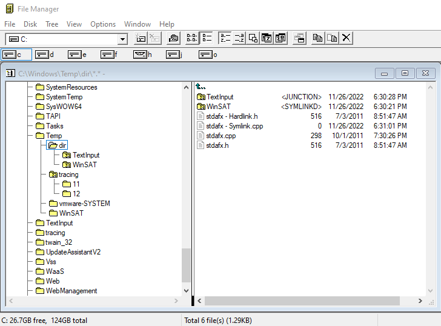

#  Windows File Manager (WinFile)

The Windows File Manager lives again and runs as a native x86, x64 and arm64 desktop app
on all currently supported version of Windows, including Windows 11. I welcome your thoughts, comments and suggestions.

There are two primary versions of the source code in the master branch:

1. original_plus tag: refers to the source for WinFile as of Windows NT4 with minimal changes
so that it compiles with Visual Studio and runs on current Windows.

2. current master: actively developed branch that consists of enhancements and additions to WinFile.

I will consider bugs fixes and suggestions for minor changes to the master branch. Feel free to create a pull request or post issues as you see fit.

I will not be changing the original_plus sources nor creating other branches for other purposes.
You are welcome to do that on your own.

## Download The App

If you are running Windows 10, you can download the app from the store

If you just want to download the WinFile application without worrying about compiling from the source code, we have a number of pre-compiled versions available.

Please select the version which you would like to download.

- [Chocolatey release](https://chocolatey.org/packages/winfile)

- Winget release: `winget install "Windows File Manager"`

- [MSYS2 release](https://packages.msys2.org/base/mingw-w64-winfile)

- [Latest Release on Github (v10.3.0.0)](https://github.com/microsoft/winfile/releases/latest)

To see more release binaries, including of older versions, [see the releases page](https://github.com/Microsoft/winfile/releases).

## History

The Windows File manager was originally released with Windows 3.0 in the early 1990s.  You
can read more about the history at https://en.wikipedia.org/wiki/File_Manager_(Windows).

## Change history

Highlights of changes in each release are in [CHANGES.md](CHANGES.md).

## What it looks like
# 

## Contributing

### Contributor License Agreement
As mentioned above, this project welcomes contributions and suggestions.  Most contributions require you to agree to a
Contributor License Agreement (CLA) declaring that you have the right to, and actually do, grant us
the rights to use your contribution. For details, visit https://cla.microsoft.com.

When you submit a pull request, a CLA-bot will automatically determine whether you need to provide
a CLA and decorate the PR appropriately (e.g., label, comment). Simply follow the instructions
provided by the bot. You will only need to do this once across all repos using our CLA.

This project has adopted the [Microsoft Open Source Code of Conduct](https://opensource.microsoft.com/codeofconduct/).
For more information see the [Code of Conduct FAQ](https://opensource.microsoft.com/codeofconduct/faq/) or
contact [opencode@microsoft.com](mailto:opencode@microsoft.com) with any additional questions or comments.

### What Makes a Good Pull Request for WinFile?
If you are interested in contributing and/or suggesting changes to the actual application, you might find it helpful to [read this post first](https://github.com/Microsoft/winfile/issues/88).

## License

Copyright (c) Microsoft Corporation. All rights reserved.

Licensed under the [MIT](LICENSE) License.
